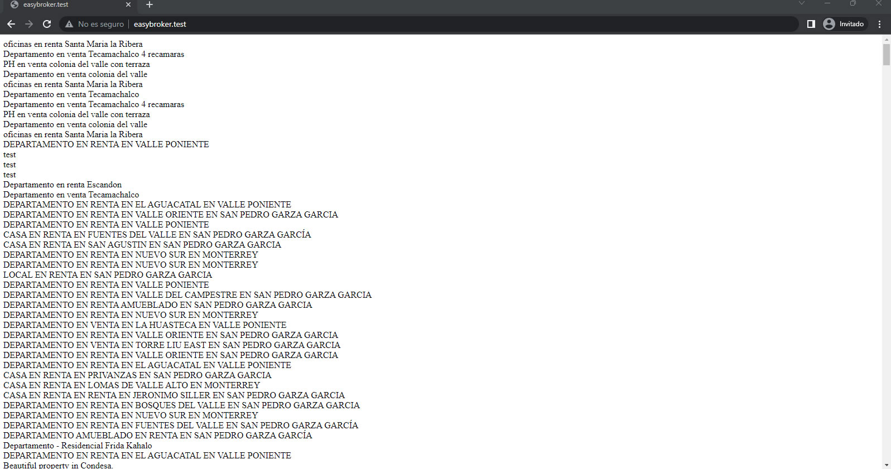
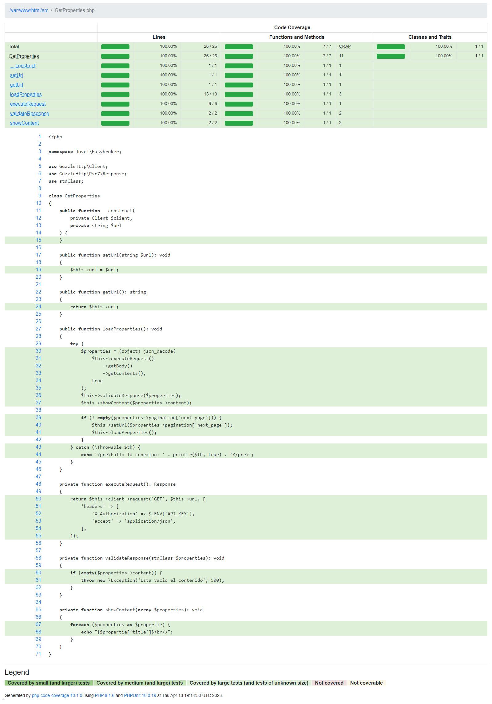
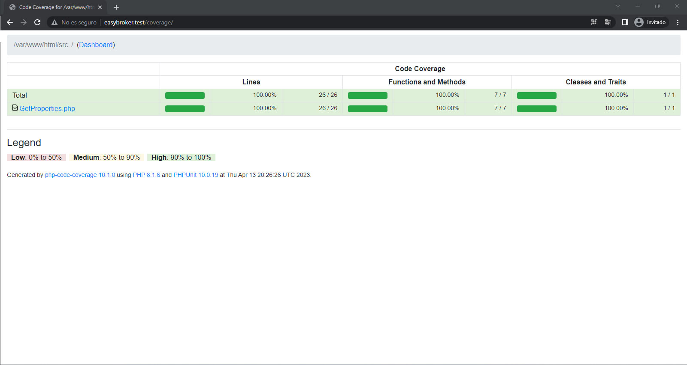

<br/>
<br/>

# :mount_fuji: Reto Técnico Sr. Full Stack Developer EasyBroker.

<br/>
<br/>

## :bookmark_tabs: Tabla de contenido.

<br/>
<br/>

1. [Autor.](#black_nib-autor)

<br/>
<br/>

2. [Detalle de la solución.](#triangular_ruler-detalle-de-la-solución)

<br/>
<br/>

3. [Desplegar.](#airplane-desplegar)

<br/>
<br/>

## :black_nib: Autor.

<br/>
<br/>

**John Fredy Velasco Bareño** [jovel882@gmail.com](mailto:jovel882@gmail.com)

## :triangular_ruler: Detalle de la solución.

<br/>
<br/>

- Usa PHP 8.1
    <br/>
    <br/>
    - Paquetes
        <br/>
        <br/>
        - Generales
            <br/>
            <br/>
            - vlucas/phpdotenv: Para el manejo de variables de entorno, puntualmente para el API_KEY.
                <br/>
                <br/>
            - guzzlehttp/guzzle: Para realizar las peticiones al API y procesar las respuestas.
                <br/>
                <br/>
        - Dev
            <br/>
            <br/>
            - phpunit/phpunit: Framework para pruebas de PHP.
                <br/>
                <br/>
            - mockery/mockery: Paquete para la generación de Stubs, Mocks y Spies.

<br/>
<br/>

Se siguió la documentación del API provista https://dev.easybroker.com/docs y se consiguió lo siguiente:

<br/>
<br/>

+ Consume este endpoint https://api.stagingeb.com/v1/properties y muestra todos los títulos de las propiedades, la clase base para la funcionalidad es [GetProperties](src/GetProperties.php).

<br/>
<br/>



<br/>
<br/>

> Para ver una imagen de la respuesta completa que se obtiene siga este [enlace](images/ResponseFull.jpg)

<br/>
<br/>

+ Se crearon pruebas unitarias para probar la clase base [GetProperties](src/GetProperties.php) en el archivo [GetPropertiesTest](tests/unit/GetPropertiesTest.php) usando Mocks para aislar la prueba y no ir directamente al API.

<br/>
<br/>

+ Se uso un análisis de cobertura para poder mantener el porcentaje lo más alto posible, en este caso se logró una cobertura del 100% de la clase base [GetProperties](src/GetProperties.php).

<br/>
<br/>



<br/>
<br/>

## :airplane: Desplegar.

<br/>
<br/>

+ Prerrequisitos

    <br/>
    <br/>

    + **Docker >= 20.\***

    <br/>
    <br/>

    + **Docker Compose >=2.\***

    <br/>
    <br/>

    + **Git >=2.\***

    <br/>
    <br/>

+ Pasos

    <br/>
    <br/>

    > :bulb: Si esta sobre algún sistema basado en Linux y ejecuta la siguiente línea se iniciará un ambiente totalmente funcional sobre el DNS [easybroker.test](http://easybroker.test/).

    <br/>
    <br/>

    ```sh

    git clone https://github.com/jovel882/easybroker.git && cd easybroker && cp .env.example .env && cp Docker/.env.example Docker/.env && docker compose -f Docker/docker-compose.yml up -d && docker logs -f easybroker

    ```

    <br/>
    <br/>

    + Clone el repositorio

        <br/>
        <br/>

        ```sh

        git clone https://github.com/jovel882/easybroker.git

        ```

        <br/>
        <br/>
            
    + Cree los archivos de entorno basados en los de ejemplo.

        <br/>
        <br/>

        + Genere el archivo ***.env*** en la raíz, este tiene solo una variable que es el **API_KEY**  que indica precisamente el que se usa para poder consumir el API. En el del ejemplo se dejó el público que está en documentación. 

        <br/>
        <br/>

        + Genere el ***.env*** dentro del folder de **Docker**, este tiene solo una variable que es el **COMPOSE_PROJECT_NAME**  que indica el nombre del proyecto que se genera con Docker Compose, en el de ejemplo se deja **easybroker**.

        <br/>
        <br/>

    + Variables dentro del archivo **"docker-compose.yml"**.

        <br/>
        <br/>

        + Dentro del servicio de nombre **"easybroker"** en la sección de **"environment"**

            <br/>
            <br/>

            + `VIRTUAL_HOST` (\*Requerido): Define el nombre del DNS sobre el que se levantara el ambiente, por defecto esta **easybroker.test**.
                
            <br/>
            <br/>

    + Ejecute el docker-compose.yml para levantar el ambiente.
    
        <br/>
        <br/>

        ```sh

        docker compose -f Docker/docker-compose.yml up -d

        ```

        <br/>
        <br/>

    + Siga el estado del despliegue del contenedor principal con el siguiente comando.

        <br/>
        <br/>

        ```sh

        docker logs -f easybroker

        ```
        <br/>
        <br/>

        > :pushpin: En este log si todo esta correcto podrá ver la instalación de paquetes con Composer, la ejecución/resultado/informe de las pruebas y finalmente el inicio de los servicios del servidor web con Supervisor entre otros.

        <br/>
        <br/>

    + Acceda al resultado de la solución **http://{DNS}/** donde **DNS** se debe cambiar por el que se definió en **VIRTUAL_HOST** del archivo **"docker-compose.yml"**. Ej. [http://easybroker.test/](http://easybroker.test/)

    <br/>
    <br/>

    + Finalmente puede ver el informe de cobertura accediendo a la URL **http://{DNS}/coverage/** donde **DNS** se debe cambiar por el que se definió en **VIRTUAL_HOST** del archivo **"docker-compose.yml"**. Ej. [http://easybroker.test/coverage/](http://easybroker.test/coverage/)

    <br/>
    <br/>

    

    <br/>
    <br/>

